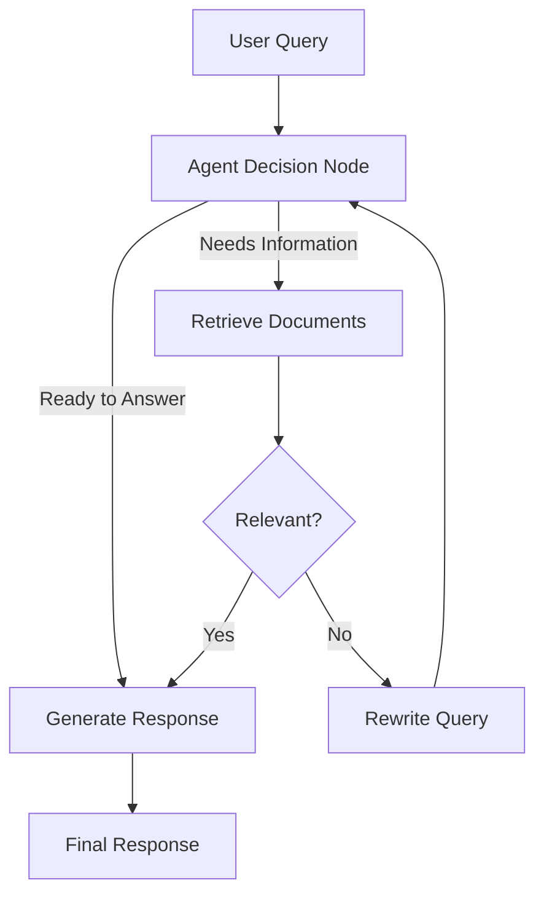

# AI Blog Search - Agentic RAG with LangGraph

[](LICENSE)
[](https://www.python.org/downloads/)

An agentic retrieval-augmented generation (RAG) application designed to enhance information retrieval from AI-related blog posts. This system leverages LangChain, LangGraph, and Google's Gemini model to fetch, process, and analyze blog content, providing users with accurate and contextually relevant answers through intelligent agent workflows.

## Overview

AI Blog Search combines multiple technologies to create an intelligent blog search system:

- **LangGraph Workflow** - Manages multi-step agentic decision-making for document retrieval and generation
- **Vector Database** - Uses Qdrant for efficient semantic search of blog content
- **LLM Integration** - Powered by Google's Gemini model for intelligent reasoning and response generation
- **Relevance Grading** - Automatically evaluates whether retrieved documents answer the user's question

## Architecture



## Features

- **Document Retrieval**: Uses Qdrant vector database to store and retrieve blog content based on semantic embeddings
- **Agentic Query Processing**: AI-powered agent determines whether to retrieve, rewrite queries, or generate answers
- **Relevance Assessment**: Automated relevance grading using Gemini to evaluate document quality
- **Query Refinement**: Dynamically enhances poorly structured queries for better retrieval results
- **Streamlit UI**: User-friendly web interface for entering blog URLs and querying content
- **Graph-Based Workflow**: Structured state graph using LangGraph for efficient decision-making

## Tech Stack

- **Language**: [Python 3.10+](https://www.python.org/downloads/)
- **Framework**: [LangChain](https://www.langchain.com/) and [LangGraph](https://langchain-ai.github.io/langgraph/)
- **Vector Database**: [Qdrant](https://qdrant.tech/)
- **LLM**: [Google Gemini API](https://ai.google.dev/gemini-api)
  - Embeddings: `models/embedding-001`
  - Chat: `gemini-2.0-flash`
- **Document Loader**: [LangChain WebBaseLoader](https://python.langchain.com/docs/integrations/document_loaders/web_base/)
- **UI**: [Streamlit](https://docs.streamlit.io/)

## Prerequisites

- Python 3.10 or higher
- Google Gemini API key (free tier available at [AI Studio](https://aistudio.google.com/apikey))
- Qdrant instance (cloud or self-hosted)

## Installation

1. **Clone the repository**
   ```bash
   git clone https://github.com/rchhabra13/ai_blog_search.git
   cd ai_blog_search
   ```

2. **Create a virtual environment**
   ```bash
   python -m venv venv
   source venv/bin/activate  # On Windows: venv\Scripts\activate
   ```

3. **Install dependencies**
   ```bash
   pip install -r requirements.txt
   ```

4. **Configure environment variables**
   ```bash
   cp .env.example .env
   ```

## Usage

1. **Start the application**
   ```bash
   streamlit run app.py
   ```

2. **Configure API Keys** (in the sidebar)
   - Enter your Qdrant Host URL
   - Enter your Qdrant API Key
   - Enter your Google Gemini API Key
   - Click "Done"

3. **Add Blog Content**
   - Paste a blog URL in the "Paste the blog link" field
   - Click "Enter URL" to process and store the blog content

4. **Query the Blog**
   - Enter your question about the blog in the "Enter your query" field
   - Click "Submit Query" to get an intelligent response

## Configuration

### Environment Variables (.env)

```bash
# Google Gemini API Configuration
GEMINI_API_KEY=your_gemini_api_key_here

# Qdrant Configuration
QDRANT_HOST=https://your-qdrant-instance.qdrant.io
QDRANT_API_KEY=your_qdrant_api_key_here
```

### Model Parameters

You can customize the following in `app.py`:

- **Embedding Model**: `models/embedding-001` (can be changed in `GoogleGenerativeAIEmbeddings`)
- **LLM Model**: `gemini-2.0-flash` (can be changed in `ChatGoogleGenerativeAI`)
- **Chunk Size**: 100 (in `RecursiveCharacterTextSplitter`)
- **Chunk Overlap**: 50 (in `RecursiveCharacterTextSplitter`)
- **Retrieval K**: 5 (number of documents to retrieve)

## Project Structure

```
ai_blog_search/
├── app.py                 # Main Streamlit application
├── requirements.txt       # Python dependencies
├── .env.example          # Environment variables template
├── .gitignore            # Git ignore patterns
└── README.md             # This file
```

## How It Works

1. **URL Processing**: Blog content is loaded and split into semantic chunks
2. **Embedding**: Each chunk is embedded using Google's embedding model
3. **Storage**: Embeddings are stored in Qdrant vector database
4. **Query Processing**: User query is processed through the LangGraph workflow
5. **Document Retrieval**: Relevant documents are retrieved based on semantic similarity
6. **Relevance Grading**: Retrieved documents are evaluated for relevance
7. **Response Generation**: If relevant, a response is generated; otherwise, query is refined
8. **Response Display**: Final answer is presented to the user

## API Usage

### Google Gemini API Costs

- Embeddings: Free tier available
- Chat (gemini-2.0-flash): Free tier available with usage limits

### Qdrant

- Free cloud instance: 1GB storage
- Paid plans available for larger storage

## Troubleshooting

### "API keys not saved"
- Ensure all three API keys are filled in the sidebar
- Click "Done" after entering all keys

### "Qdrant connection failed"
- Verify your Qdrant Host URL is correct
- Check that your Qdrant API Key is valid
- Ensure internet connectivity

### "Document processing error"
- Verify the blog URL is accessible and returns valid HTML
- Check that the blog content contains text (not just images)

### "No documents retrieved"
- Ensure documents were successfully added (should see "Documents added successfully" message)
- Try a different query with more specific keywords
- Check that the blog content is relevant to your query

## Examples

### Example Queries

- "What does this blog say about agent memory types?"
- "Summarize the main points about prompt engineering"
- "What are the key findings about adversarial attacks?"
- "Explain the chain-of-thought methodology"

### Example Blog URLs

- [Lian Weng's Agent Post](https://lilianweng.github.io/posts/2023-06-23-agent/)
- [Lian Weng's Prompt Engineering](https://lilianweng.github.io/posts/2023-03-15-prompt-engineering/)

## License

This project is licensed under the MIT License - see the [LICENSE](LICENSE) file for details.

## Contributing

Contributions are welcome! Please feel free to submit a Pull Request.

## Support

For questions and support:
- Create an issue on [GitHub](https://github.com/rchhabra13/ai_blog_search/issues)
- Check the [documentation](https://python.langchain.com/)

## Author

[Rishi Chhabra](https://github.com/rchhabra13)

---

Built with LangChain, LangGraph, and Google Gemini API
